# VoyageAgent - Intelligent Travel Planning AI Agent

VoyageAgent is a production-grade, highly interactive Intelligent Travel Planning AI Agent designed to help users curate personalized 2-day itineraries to major global destinations (Tokyo, Paris, Singapore). The system combines dynamic tool calling, dual-layer memory management, a multi-hop RAG pipeline, and a dark-themed glassmorphism single-page web application.

---

## Technical Architecture Diagram

```mermaid
graph TD
    User([User UI / Chat REST API]) <--> AppServer[FastAPI Web Server]
    
    subgraph Agent_Core [Agent Planning & Reasoning]
        Planner[Plan-and-Execute Engine]
        LLM[Gemini 2.5 Flash Model]
    end
    
    subgraph Memory_System [Dual-Layer Memory Manager]
        STMemory[Short-Term Memory <br> Conversation History]
        LTMemory[Long-Term Memory <br> FAISS Vector Database]
    end
    
    subgraph Data_RAG [Context Enrichment]
        RAGEngine[Multi-Hop RAG Pipeline]
        Corpus[(Attractions & Local Blogs DB)]
    end
    
    subgraph Tool_Suite [Dynamic Tool Suite]
        WeatherTool[Live Weather API Tool]
        CurrencyTool[Live Currency Exchange Tool]
        HotelTool[Accommodation & Flights DB]
        AttrTool[Attractions Search DB]
    end
 
    AppServer <--> Planner
    Planner <--> STMemory
    Planner <--> LTMemory
    Planner <--> RAGEngine
    Planner <--> Tool_Suite
    
    %% Interactions
    LTMemory -. Cosine Similarity .-> FAISS_Index[(FAISS Index file)]
    RAGEngine -. Hop 1 & 2 .-> Corpus
    LLM <--> Planner
```



---

## Key Architectural Decisions & Component Design

### 1. Planning & Reasoning Mechanism (Plan-and-Execute)
Rather than relying on fragile, multi-turn LLM loops that are prone to latency spikes and hallucinated API invocations, VoyageAgent implements a robust Plan-and-Execute framework:
- **Parameter Extraction**: The user's query is analyzed to extract constraints: target city, budget constraints, pet-friendliness, and interest categories (e.g., *sushi*, *anime*, *gardens*).
- **Goal Deconstruction**: The planner decomposes the travel goal into 5 strict sub-tasks:
  1. Retrieve past preferences from FAISS Long-Term Memory.
  2. Perform Multi-Hop RAG for deep local guides and cultural rules.
  3. Query the Live Weather API (Open-Meteo) for dynamic forecast adjustments.
  4. Query the Live Currency API (ExchangeRate-API) to map global budgets accurately.
  5. Query the Accommodation Tool to identify budget-matched, pet-friendly hotels.
  6. Query the Attractions Tool for activities matching constraints.
- **Synthesis**: The aggregated outputs of all sub-tasks are compiled into a comprehensive prompt context and passed to the generator (Google Gemini) to construct a highly unified, customized 2-day markdown itinerary.
 
### 2. Dual-Layer Memory Management (FAISS Vector Store)
- **Short-Term Memory (`ShortTermMemory`)**: An in-memory conversation list that maintains structural dialogue context across turns, enabling follow-up questions (e.g., *"What about a cheaper hotel?"*).
- **Long-Term Memory (`FAISSPreferenceMemory`)**: 
  - Uses a FAISS (`faiss-cpu`) vector index (`faiss.IndexFlatIP`) for semantic similarity lookups.
  - To index text preferences without requiring costly, rate-limited external embedding APIs, the system transforms preferences into a dense 128-dimensional travel concept space using keyword-frequency vectors, normalized to unit length so that inner product equals Cosine Similarity.
  - Automatically indexes new preferences during conversation (e.g., *"I travel with a dog"* generates a pet-friendly preference vector).
  - Persists the FAISS index (`preferences.index`) and meta (`preferences.json`) to disk, ensuring preferences survive system restarts.
 
### 3. Multi-Hop RAG (Retrieval-Augmented Generation)
- **Hop 1 (Primary Retrieval)**: Finds core matches for user search queries from the structured attraction base (e.g., searching for *Tokyo Senso-ji Temple*).
- **Hop 2 (Secondary Entity Expansion)**: Parses the Hop 1 results to identify adjacent sub-entities (e.g. *Nakamise-dori street snacks*, *Hachiko statue*, or *sushi guidelines*) and triggers a secondary search in a specialized corpus of deep tourist guides and etiquette blogs.
- Combines results from both hops to inject valuable cultural tips (such as *sushi-eating etiquette in Japan* or *Singapore hawker table reservation rules*) into the itinerary.
 
### 4. Dynamic Tool Suite
- **Live Weather API (Open-Meteo)**: Dynamically geocodes the target city and fetches real-time temperature and precipitation probabilities.
- **Live Currency API (ExchangeRate-API)**: Pulls real-time global exchange rates to accurately convert user USD budgets into local currency estimations.
- **Deterministic Flight Estimator**: Calculates semi-realistic round-trip flight costs based on a deterministic string hash of the origin and destination, intelligently bypassing long-haul pricing for domestic regional routes.
- **Accommodation & Attractions DB**: Performs multi-factor query filtering on tourism spots and hotels based on budget, interest tags, and pet-friendliness.
 
---

## Codebase Directory Structure

```text
intern/
│
├── agent/
│   ├── __init__.py
│   ├── memory.py        # Short-term history & Long-term FAISS preference manager
│   ├── tools.py         # Weather, accommodation, attraction, and web search APIs
│   ├── rag.py           # Multi-hop retrieval engine over deep local blogs
│   └── planner.py       # Central Plan-and-Execute reasoning coordinator
│
├── data/
│   ├── attractions.json # Destinational static database
│   └── memory/          # FAISS persisted index & metadata (generated at runtime)
│       ├── preferences.index
│       └── preferences.json
│
├── static/
│   ├── index.html       # Elegant dashboard HTML
│   ├── index.css        # Premium dark glassmorphism styling
│   └── index.js         # Reactive UI, Markdown engine, and API links
│
├── main.py              # FastAPI server entry point & REST API router
├── .env                 # Environment configurations (Gemini Key)
└── README.md            # Comprehensive documentation (this file)
```

---

## Setup & Execution Guide

### Prerequisites
VoyageAgent requires Python 3.10+. The standard library and package system handles the rest.

### 1. Installation
Clone or navigate to the project directory and install the required dependencies:
```powershell
pip install fastapi uvicorn faiss-cpu python-dotenv google-genai
```

### 2. Configure Google Gemini
For unrestricted, fully creative AI generation, create a `.env` file in the root directory:
```env
GEMINI_API_KEY=your_actual_gemini_api_key_here
```
*Note: A valid API key is required to query the Gemini endpoints and perform dynamic extractions.*

### 3. Run the Server
Launch the FastAPI server:
```powershell
python main.py
```
Or use uvicorn directly:
```powershell
uvicorn main:app --reload --host 127.0.0.1 --port 8000
```

### 4. Open the Interface
Open your web browser and navigate to:
[http://127.0.0.1:8000](http://127.0.0.1:8000)

---

## REST API Documentation

FastAPI automatically generates interactive Swagger API documentation. You can explore and test all endpoints directly at [http://127.0.0.1:8000/docs](http://127.0.0.1:8000/docs).

### Primary Endpoints:

#### 1. Chat & Planning (`POST /api/chat`)
Interacts with the Plan-and-Execute Travel Agent.
- **Request Body**:
  ```json
  {
    "message": "Plan a 2-day trip to Tokyo with $800 budget. I travel with my dog and love anime.",
    "session_id": "default"
  }
  ```
- **Response Shape**: Includes final Markdown response, detailed reasoning log, extracted parameters, FAISS preferences used, and RAG logs.

#### 2. Get Indexed Memories (`GET /api/preferences`)
Fetches all preferences currently indexed in the FAISS database.

#### 3. Inject Manual Preference (`POST /api/preferences`)
Manually inserts and vectorizes a preference in the FAISS database.
- **Request Body**:
  ```json
  {
    "preference": "I prefer vegetarian food and luxury hotels."
  }
  ```

#### 4. Delete Memory (`DELETE /api/preferences/{index}`)
Deletes a preference and rebuilds the FAISS index to align vector matches.

#### 5. Configure API Key (`POST /api/config`)
Dynamically updates the Gemini API Key at runtime without server restart.

---

## Premium UI Highlights (Wow Features)
- **Glassmorphism Dark Theme**: Elegant cosmic gradients, translucent containers, and border glows that feel highly premium.
- **Agent Reasoning Trace**: Interactive timeline in the left sidebar that exposes the inner thoughts and sub-tasks of the Plan-and-Execute agent in real-time.
- **FAISS Memory Manager**: Active CRUD interface in the right sidebar demonstrating live updates to the FAISS database.
- **Multi-Hop RAG Visualizer**: Displays the dynamic, secondary document hops retrieved during synthesis.
- **Interactive Budget Breakdown Table**: Beautifully formatted financial grids compiling estimated costs against constraints.
